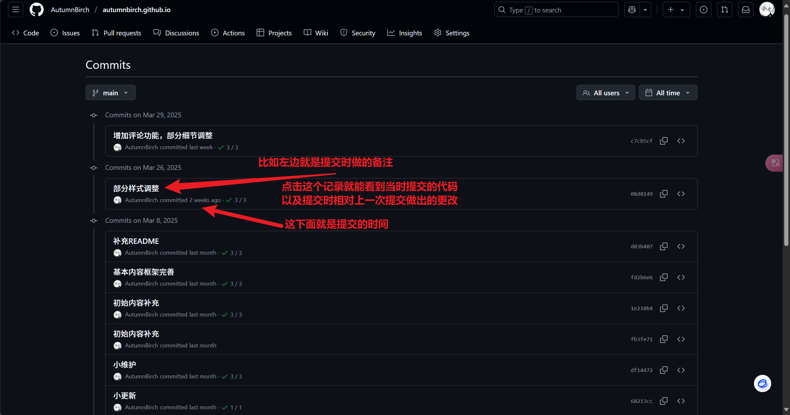

前言：本文主要提供GitHub的基础介绍、Windows系统的Git基础安装使用教程，以及在Vscode中使用Git的教程。

## 一、Github基础介绍

GitHub是一个基于Git的代码托管平台，支持开发者协作开发、版本控制及开源项目管理。

**账号注册过程略过，直接进入页面常用主要功能介绍：**

### 1.1 Home界面：

* **Pull Requests：** 你对其他人的开源项目感兴趣，对其做出了改进想要提交给对方，此时就需要pull requests；
* **Issues：** 在学习使用其他人的项目时发现了问题/bug，可以通过在issues界面提出反馈，可以简单理解为评论；
* **Repository：** 仓库，可以理解为一个功能更强大的文件夹，每个仓库都是你对应项目的存储空间，存储你对应项目内的所有文件，包括代码、文档、图片、配置文件等等。


### 1.2 个人页面

* **star：** 对喜欢的项目点赞并收藏；
* **Follow：** 关注对应用户；


### 1.3 仓库页面

由于内容较多，图中框框内的较为重要的部分功能都在下方以文字形式介绍：


#### 1.3.1 顶部

|标签|用途|
| ------| ----------------------------------------------|
|​`Code`​|查看代码文件（默认页）|
|​`Issues`​|提交 Bug 或功能请求|
|​`Pull requests`​|合并他人代码到主分支（协作时用）|
|​`Actions`​|查看自动化任务（如这个仓库的 22 次部署记录）|
|​`Settings`​|配置仓库权限、域名等|

|按钮|功能|
| ------| ----------------------------------------------|
|​`Pin`​|将仓库置顶到个人主页（便于快速访问）|
|​`Unwatch`​|取消关注更新（默认会收到邮件提醒）|
|​`Fork`​|复制仓库到你的账户下（独立修改不影响原仓库）|
|​`Star`​|收藏仓库（类似点赞，提升项目可见度）|

#### 1.3.2 右侧

* **​`About`​**​ **仓库描述/简介**

  * **直达链接**：`autumnbirch.github.io`​（点击访问托管的博客）；
  * **README 摘要**：展示仓库描述；
* **Deployments**：通过 GitHub Actions 自动发布到 GitHub Pages；

|模块|用途|
| ------| ----------------------------|
|​`Releases`​|发布正式版本|
|​`Packages`​|发布 npm 等软件包|
|​`Languages`​|统计代码使用的编程语言占比|

#### 1.3.3 中间

* `main`​代表该项目的主分支；
* `Add File`​可以直接添加文件到仓库中；
* `code`​提供仓库地址以供克隆文件，也可以在这里直接下载对应项目源代码；
* 中间一块是项目的源代码；
* README：展示你源代码根目录下README.md文件内的内容，可以理解为项目的说明书。

## 二、Git基础介绍

### 2.1 概念

官方文档太长，所以首先引用[开始使用 Git - GitHub 文档](https://docs.github.com/zh/get-started/learning-to-code/getting-started-with-git#review-and-next-steps)的描述：

> 你是否曾希望有一台用于代码的时间机器？ Git 正好可以满足你的需要，而且还能为你提供更多！
>
> 如果你还不了解 Git：它是一个**版本控制**系统，可帮助跟踪代码的更改。 可以在某个特定时间点保存项目的快照，然后进行试验性更改，而不会给项目带来风险，因为始终可以返回快照。
>
> GitHub 本身是一个围绕 Git 构建的平台，支持你将 Git 项目保存到云中，并**与其他开发人员协作处理项目**。
>
> 虽然 Git 可能比较复杂，但却是能够为开发人员提供必要功能的强大工具。 本文将介绍在日常工作流程中使用 Git 所需的所有工具。

抽象地来说，**Git**<span data-type="text" style="font-size: 16px;">是一个</span>**分布式版本控制系统**<span data-type="text" style="font-size: 16px;">。</span>

**简单做个比喻：GIt——可以查看过往代码的时光机。**


### 2.2 那分布式版本控制系统是什么呢？

2.2.1 **先说版本控制：**

**版本控制是一种记录一个或若干文件内容变化，以便将来查阅特定版本修订情况的系统。**

* 就拿各大社交媒体软件的**浏览记录/历史记录**打比方，如B站，每当你浏览一个视频，你都可以在历史记录里面找到对应时间你看的那个视频记录（链接），只要一点击，你就能回到你先前所看视频的页面，甚至页面还保存着你的观看进度；

* 而版本控制系统可以在你每次**提交代码**（类比浏览视频）时留下记录——你对代码的**备注**（对应历史记录内的视频名称），同时并**保存你当时提交的代码**（观看进度）；

* 那么在长期开发一个项目时，如果遇到问题，就可以通过版本控制系统（历史记录）找到你过往提交的所有代码的备注，根据出现的问题和代码更改的备注，找到对应时间更改并进行提交的代码，从而做到问题的快速排查。
* 以下提供GitHub页面的截图帮助理解：




2.2.2 **然后是分布式：**

想象你的代码是一棵树，主干是大家公认的稳定版本，任何开发者都可以：

* 从主干的某个位置分出新枝（创建分支）；
* 在自己的树枝上培育新品种（独立开发）；
* 把成熟的新枝推荐给主干（发起合并请求）；

每个开发者都拥有一整棵树的克隆体（完整仓库），可以自由决定何时与其他人的树交换枝条（代码同步）。这样既不怕弄坏主干，又能让多人同时培育不同功能，最后把最好的成果合并到一起。

抽象一点说就是：

* Git的分布式体现为每个开发者都拥有完整的仓库副本，包含所有分支和历史记录。开发者可独立在本地创建分支、提交代码，之后通过推送分支到远程仓库或发起Pull Request来协作。主干（如main分支）作为稳定分支，开发通常在特性分支进行。这种模式支持离线工作、多分支并行开发，以及灵活的协作方式（如fork仓库、共享分支等），版本控制贯穿整个生命周期。

## 三、软件安装

### 3.1 Git

知道Git的用途后，我们就可以开始尝试学习、使用Git帮助我们管理自己项目的代码了，而在此之前我们需要先安装它。

Git官网：[Git - Downloading Package](https://git-scm.com/downloads/win) 或者 [Git for Windows](https://gitforwindows.org/)。

前者进入后点击文档开头的Click here to download即可下载Git的最新安装包，后者点击屏幕上大大的Download即可。

（由于GitHub较为不稳定，故以下提供蓝奏云链接）

[https://wwlj.lanzoum.com/ib0ES2thy8of](https://wwlj.lanzoum.com/ib0ES2thy8of)  
密码:6s6m

**下载完成后双击可执行程序开始安装**

1. 安装时注意勾选该项：


2. 接着无脑点下一步即可。
3. 安装完成后右键桌面打开终端

    
4. 在终端中输入`git --version`​，终端返回git版本号则说明安装成果：

    

### 3.2 Vscode

Vscode是一款由微软推出的免费、开源、跨平台的代码编辑器，轻量快速，非常适合用来写HTML 、CSS、JavaScript、TypeScript等编程语言，安装扩展也可以支持支持 Python、C/C++、Java 和 Go语言等编程语言。

Vscode官网：[安装 Visual Studio Code](https://code.visualstudio.com/download)

安装过程较简单，故此处不赘述。

（PS：非常好用的代码编辑器，强力推荐！）

## 四、Git的使用

在成功安装Git后，我们就可以开始准备使用它了，而在此之前，我们还需要一点前置工作。

### 4.1 SSH配置

1. 配置个人信息

```bash
git config --global user.name "你的名字"

git config --global user.email "你的邮箱"
```

2. 生成SSH密钥

```bash
ssh-keygen -t rsa -C "你的邮箱"
```

上述命令输入完成后，连按三次回车即可在你的用户目录下生成ssh密钥，效果如下：


在文件资源管理器中，根据路径可以找到密钥：


如果在上一级目录中看不到.ssh文件夹，可能是未勾选以下选项：

3. 在GitHub中： 进⼊ Settings \> SSH and GPG keys \> New SSH key，粘贴公钥并保存。

* 在GitHub任意页面（此处为个人界面），点击右上角头像，点击setting，进入设置页面：


* 新建ssh密钥：


* 复制粘贴密钥并保存确认：


* 完成添加：


* 完成添加后，你用于注册GitHub账户的邮箱将会收到一条密钥已绑定的通知邮件。

* 最后使用以下命令测试一下连接：

```bash
ssh -T git@github.com
```


### 4.2 使用Git命令

ssh配置好后，我们就可以尝试将自己的项目文件通过git推送到GitHub上了。

1. 首先在GitHub上创建一个空的仓库：


成功后你就拥有了一个空的仓库。

接着就可以通过git将本地的项目文件推送到位于GitHub的远程仓库里了。

‍

**以下是常用的命令：**

```bash
git init # 初始化本地git仓库
# 在你的项目根目录（如 C:\14_Project\C）生成隐藏的 .git 文件夹，记录所有版本变更。

git add 文件名 # 将文件添加到暂存区（待提交列表）
# 可用 git add . 添加全部变更，“.”表示选择所有文件。

git commit -m "提交说明" # 提交代码到本地仓库，提交说明就是对这次代码更改的备注

git branch -M main # 将默认分支重命名为 main
# 旧版 Git 默认分支名为 master，现主流改为 main（GitHub 默认分支名）。

git remote add origin git@github.com:用户名/仓库名.git # 关联远程仓库（GitHub 仓库地址）
# origin 是远程仓库的别名（可自定义，但 origin 是通用习惯）。

git push -u origin main # 推送代码至远程仓库，如GitHub，初始分支一般为main
# -u 表示设置上游关联（后续直接 git push 即可，无需重复指定分支）。

git clone 仓库地址 # 克隆远程仓库，也可以在对应项目页面手动下载
git log # 查看提交历史记录
git status # 查看当前文件变化情况
git branch 分支名 # 创建分支
git checkout 分支名 # 切换分支
git merge 分支名 # 合并分支
git pull origin 分支名 # 从远程仓库拉取最新文件
```

有点多是吧，不过也不用背，用多了自然就记住了。

下面简单应用一下。

1. 先创建一个文件夹，打开它，创建一个文本文档，随便在里面写些东西；


2. 在文件夹内右键打开终端，此时路径就在对应文件夹下；
3. 在终端内执行常用命令的前六条，如图：


命令成功执行完成后，回到GitHub，你就可以在你的仓库内看到推送上去的文件了：


有些命令只是一开始用得多，之后推送文件一般有`git add 文件名`​，`git commit -m "提交说明"`​，`git push origin main`​三条就够了。

然后你还可以在本地创建一个README.md文件，它就像是你项目的说明书，你对应项目的介绍说明都可以通过markdown语法写在里面，其中的内容会被渲染显示在上图的“Add a README”部分。

### 4.3 在Vscode中使用git

1. 右键文件夹空白处→显示更多选项→在Vscode中打开文件夹：


2. 对文档做出更改，按`ctrl + s`​快捷键保存：


3. 使用终端或者点击左边的提交将文件提交至本地仓库：


4. 推送更改至远程仓库：


（上面说效果相同有点问题，应该说在推送前多了一步拉取的操作，因为我们这里的远程仓库没有其他人做出的更改，所以说效果相同，都是把我们的更改推送上去。）

点击同步更改后，会出现以下弹窗：


这是 VSCode 的 “安全同步提示”，说明你的 Git 同步操作会同时拉取（pull）远程更新，并推送（push）本地提交，这里我们直接点击确定即可。

5. 回到GitHub仓库，可以看到更改已经成功提交，点击commit即可看到历史提交记录，对应的，每次记录点击进去都可以看到每次做出的更改。

（在vscode的源代码管理→图形部分也可以点击查看更改记录，相当于一个图形化的git工具。）


至此，本次教程结束，以下为总结部分。

## 五、总结

感谢您能看到最后，教程可能有些粗糙，不足之处欢迎指出，博主会及时修正。

2025-04-13

‍

  

‍
