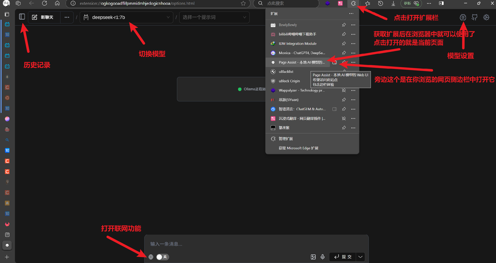

<!-- # 简单的本地AI部署教程 -->

**前言**：本教程以**DeepSeek-R1-7B**为例，进行AI本地部署流程教学。

在本地部署AI大模型前，请确认您的硬件能够满足部署需求（主要确认显存）：

> 显存需求计算公式：M=((P×4B) / (32/Q))×1.2

> 其中，M是显存需求量，单位为字节；P为模型参数量；4B表示当模型采用默认精度时，每个参数占用4字节（即32个比特）；Q表示量化比特数，即每个参数量化为多少比特。1.2表示额外预留20%显存余量。当我们采用10亿（即B）为单位计量参数规模时，计算结果的单位恰好是GB字节。例如，对于7B参数规模的模型，如果采用4比特量化，模型推理所需显存为7x4/(32/4)x1.2=4.2GB。然而，在实际使用中显存使用量略高于该估计，主要受到输入输出序列长度和量化算法影响，量化算法通常采用混合精度，并不能保证全部参数量化为4比特。

> 以上公式及介绍参考自 ：​[本地部署的 AI 大模型，需要的计算资源容量，应该如何计算？ - 知乎](https://www.zhihu.com/question/12432779929)的问答中，博主“蒹葭苍苍”的回答。

关于量化：

ollama上的模型大部分为Q4量化，本文所提到的模型也均为Q4量化版，对于其他具体模型的量化方式，建议查看其对应页面的标识。


好，那么下面开始教程：

## 一、**安装 Ollama（核心部署工具）**

1. **下载地址**：[Download Ollama on Windows](https://ollama.com/download)
3. 安装流程：

    1. 双击下载的安装包（默认安装至 `C:\Program Files\Ollama`​）；
    2. 安装完成后，打开终端，或者按 `Win + R`​ 输入 `cmd`​ 打开命令提示符；
    3. 验证安装：输入 `ollama -v`​，若返回版本号，如：`ollama version is 0.3.6`​则代表成功；

## 二、**拉取模型**

ollama提供了多个模型，可以直接下载，也可以自己训练；

1. **执行命令**：

```bash
ollama run deepseek-r1:7b
```

* 此命令会自动下载并启动7B量化版模型；

* **断点续传**：若下载中断，按 `Ctrl + C`​ 停止后重新执行同一命令即可继续。

* 你如果不想直接运行，也可以先下载模型，想用时再运行：

```bash
拉取模型：
	ollama pull deepseek-r1:7b
运行模型：
	ollama run deepseek-r1:7b
```

2. 如果是部署其他模型则执行相应命令：

|**Model**|**Parameters**|**Size**|**Download**|
| -------------| ------| -------| ------|
|DeepSeek-R1|7B|4.7GB|​`ollama run deepseek-r1:7b`​|
|DeepSeek-R1|671B|404GB|​`ollama run deepseek-r1:671b`​|
|QwQ|32B|20GB|​`ollama run qwq`​|
|Qwen2.5|7B|4.7GB|​`ollama run qwen2.5`​|
|Gemma3|4B|3.3GB|​`ollama run gemma3`​|
|Phi 4|14B|9.1GB|​`ollama run phi4`​|
|Mistral|7B|4.1GB|​`ollama run mistral`​|
|Llama 3.1|8B|4.7GB|​`ollama run llama3.1`​|
|Llama 3.1|405B|231GB|​`ollama run llama3.1:405b`​|

‍

（对各类新模型感兴趣可去[Ollama](https://ollama.com/models)模型页面寻找，其有着丰富的模型库，支持一键安装和管理超过 1700 个模型，模型格式主要为 GGUF。）

## 三、使用、及交互界面优化

### 3.1 直接使用

模型拉取完成后，命令提示符和终端就是你的初始交互界面；

```bash
仍然通过以下命令启动模型：
ollama run deepseek-r1:7b
```

出现以下内容时，即可开始对话：

> Send a message (/? for help)

比如这里输入“你好”，观察模型是否正常运行输出内容。


* 按快捷键 Ctrl + d 或者输入`/bye`​可以结束当前对话。

**以下为常用命令**：

```bash
ollama show deepseek-r1 // 查看模型信息
ollam stop deepseek-r1 // 停止正在运行的对应模型
ollam list 			  // 列出已经下载的模型
ollam rm deepseek-r1 // 删除已经下载的对应模型
```

---

### 3.2 **安装图形化界面**

虽然模型已经可以使用，但每次都需要在终端中输入命令：`ollama run deepseek-r1:7b`​，较为不便；

所以，为了更加简便地使用模型，我们可以尝试使用一些图形化界面，例如：

* [Chatbox](https://chatboxai.app/zh)

* 浏览器插件 [Page Assist](https://github.com/n4ze3m/page-assist) (Chrome Extension) ；

下面是使用教程：

**注意：使用图形化界面需提前启动 Ollama 服务。**

#### 3.2.1 **Chatbox**

* **下载地址**：[https://chatboxai.app/en#](https://chatboxai.app/en#)  

  * **配置步骤**：

    1. 安装后打开 Chatbox，进入 `Settings`​ → `Model Settings`​。
    2. 选择 `Ollama API`​，填入地址 `http://127.0.0.1:11434`​ 或者 `http://localhost:11434`​（Ollama 安装的 AI 模型，默认是提供 API 的）。
    3. 模型列表中选择 `deepseek-r1:7b`​，保存配置。

如图，完成配置后点击左上角`deepseek-r1-7b`​或者返回按钮返回对话界面即可使用：


#### 3.2.2 浏览器扩展（**Page Assist）**

* **安装地址**：Chrome或者Edge的扩展应用商店搜索 **Page Assist**
* 获取扩展后即可在扩展栏打开交互界面：



* 有关当前聊天模型温度、随机种子等值的设置，及该扩展的一些其他功能设置各位可自行探索；

* 除了一些常规设置，**Page Assist**支持的很多功能设置相当实用，例如更换联网搜索引擎更改语料来源，语音转文本与文本转语音，图片文字识别（OCR）等。


‍

## 四、总结

部署教程如上；

以下为**适合个人本地部署使用**的**性价比较高**的模型：

1. **性价比首选**：QwQ-32B（**总体能力大致为完整R1模型的85%-90%** ）和DeepSeek-R1（从1.5B到671B模型都有）。

    * （QWQ-32B模型部署最低需要**单卡8GB显存+32GB内存**，并开启**内存共享**；或者**单卡24GB显存（如4090）** 可完美运行。）

2. **中文场景**：ChatGLM-6B和Qwen-7B。

3. **低配置设备**：Mistral-7B量化版或Gemma-2B。
4. **进阶开发**：LLaMA 3和Janus-Pro-7B（多模态）

2025-04-08

‍

‍
