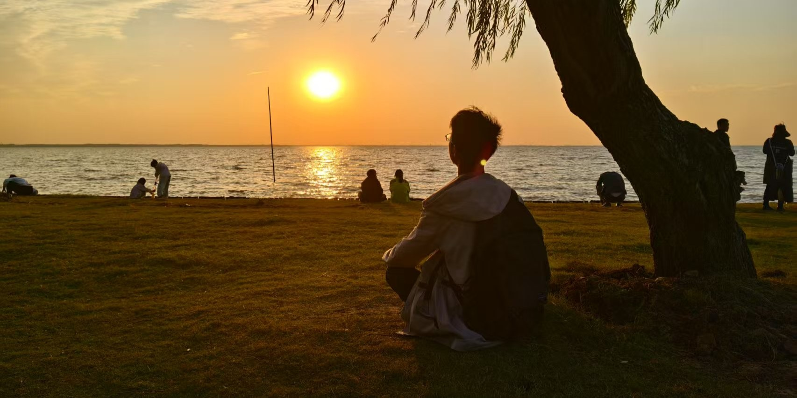

import RandomText from '../../components/RandomText.astro';

<RandomText sentences={[
  "天行健，君子以自强不息。地势坤，君子以厚德载物。",
  "预测未来的最好方式是亲手创造未来",
  "唯一无法完成的旅程是你从未开始的那段旅程。",
  "实践是检验真理的唯一标准。",
  "只要明天仍然存在，今天就永远是起跑线。",
  "愿你的生命中有够多的云翳，来造就一个美丽的黄昏。",
  "生活从未变得容易，只是我们变得更加坚强。",
  "时光如水，总是无言。你若安好，便是晴天。",
  "把月亮作为目标，如果没打中，也许还能打中星星。",
  "愿相会于中华腾飞世界时。",
  "世上无难事，只怕有心人。",
  "永不言弃",
  "我很平凡，但我独一无二。"
]} />

## 关于作者

<a href="https://space.bilibili.com/3546706348084176" style="padding: 6px;font-size: 14px;text-decoration: none;" className="iconfont icon-bilibili">Bilibili</a>
<a href="https://github.com/maindraster" style="padding: 6px;font-size: 14px;text-decoration: none;" className="iconfont icon-github">GitHub</a>
<a href="https://www.zhihu.com/people/qcng" style="padding: 6px;font-size: 14px;text-decoration: none;" className="iconfont icon-zhihu">知乎</a>

<b>AB</b>

网名甚多，索性选了常用的

大二学生，原属土木工程专业，现已跑路至数据科学与大数据技术专业

我的技术栈

JavaSE,MySQL,JDBC

SpringBoot基础, MyBatis,Maven

HTML,CSS,Javascript,Vue3.0

C,Python,GdScript,C#

学习中/待学习:Tomcat,JSP,Servlet,TypeScript,C++

  

Q&A

为什么叫“AB”？

AutumnBirch缩写，因为喜欢秋天的富饶、成功与收获,也喜欢白桦的温柔、坚韧、治愈与新生，所以二者各取一字，就叫秋樺，翻译成英语就是AutumnBirch。

为什么建立这个博客？

1. 可以当简历/写到简历里（笑）；

2. 分享自己学习/生活过程中遇到的困难、个人解决这些问题的方式方法，以及一些杂项教程。

现在在做什么？

目前主要在学JavaWeb，然后是写各种大小项目练手，接下来应该会先向后端/全栈开发这方面靠拢并且深入学习；

- 其次就是持续完善本站内容，写点经验之谈以及杂七杂八的教程；

- （个人笔记有些杂乱，整理完成后会挑选部分上传至此）

- 之后可能会根据兴趣学些其他工科专业的内容,，如STM32单片机之类的🤔，当然（是在真的特别闲的情况下），权作兴趣，不过这应该都是后话了。

## 关于本文档
本站于转专业跑路前开始搭建，作为非科班的学生，我非常庆幸自己能够依靠兴趣持续学习计算机相关知识，完成以上内容；而如今离开了原专业，有了更多接触计算机的时间，我相信自己一定能够通过互联网学习更多有用的知识并将它们传播出去，给需要的人们以力所能及的帮助。

版权声明：详见[CC BY-NC-SA 4.0](https://creativecommons.org/licenses/by-nc-sa/4.0/)

2025-03-08

(PS:由于转专业后课业繁多，博客内容预计每月更新一次。)